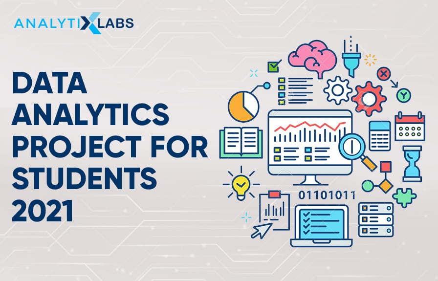

## Rio-Project
This is just a test project for my learning purpose
## Introduction
This project was use for practice in the training process
Data Analysis is the process of systematically applying statistical and/or logical techniques to describe and illustrate, condense and recap, and evaluate data.
An essential component of ensuring data integrity is the accurate and appropriate analysis of research findings. Improper statistical analyses distort scientific findings, mislead casual readers (Shepard, 2002), and may negatively influence the public perception of research. Integrity issues are just as relevant to analysis of non-statistical data as well.

## Problem Statement
+ A problem statement is a statement of a current issue or problem that requires timely action to improve the situation.
+ This statement concisely explains the barrier the current problem places between a functional process and/or product and the current (problematic) state of affairs.
+ This statement is completely objective, focusing only on the facts of the problem and leaving out any subjective opinions.
+ To make this easier, it's recommended that you ask who, what, when, where and why to create the structure for your problem statement.
+ This will also make it easier to create and read, and makes the problem at hand more comprehensible and therefore solvable.
+ The problem statement, in addition to defining a pressing issue, is a lead-in to a proposal of a timely, effective solution.

## Data Source
The data used in this project is from irelevant topics i found on the internet. 
I did not even read the content of what is posted here as it only intended for this learning purpose.
They may not make sense as they are not even from a single source on the internet.
They were gotten from different random topics on the internet.

## Skills Demonstration
SQL
PowerBI concept
The above are the applications i could have used in the project but:
+ I have limited time for this project
+ I was not informed of the project on time
+ I was still in the learning process
+ I did not know much about the two applications above
+ So I could not have used them.
+ I am just learning

## Data Modeling

OLD MODEL          |    NEW MODEL
:-------------:    |    :--------------:
     |    

## CONCLUSION

I LOVE THIS CLASS
